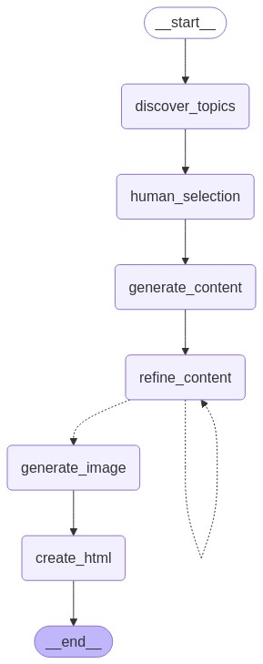

# AI Content Creation Agent

A Generative AI-driven Content Creation Agent built using Python and LangGraph. This agent automates the process of discovering trending AI topics, generating high-quality content, refining it through self-critique, generating accompanying images, and formatting the final output as an HTML page.



## Features

- **Trending Topic Discovery**: Scrapes web sources to find current trending AI topics
- **Human-in-the-Loop Topic Selection**: Allows user to select from discovered trending topics
- **Content Generation**: Creates well-structured blog posts using Llama 3.3 70B via Lepton API
- **Self-Critique and Refinement**: Implements a reflection mechanism with up to 4 iterations
- **Image Generation**: Creates relevant images using Lepton's SDXL API
- **HTML Page Creation**: Formats the final content into an appealing HTML page
- **Logging System**: Component-level logging for tracking process execution

## Architecture

The application uses LangGraph to orchestrate a workflow through the following components:

1. **Topic Discovery**: Scrapes web sources and identifies trending AI topics
2. **Human Selection**: Implements a human-in-the-loop mechanism for topic selection
3. **Content Generation**: Generates initial content using Llama 3.3 70B
4. **Content Refinement**: Implements iterative self-critique and improvement
5. **Image Generation**: Creates a relevant image using Lepton's SDXL API
6. **HTML Formatting**: Creates the final HTML output

## Setup

### Prerequisites

- Python 3.10+
- Lepton API key (included in .env file)

### Installation

1. Clone this repository:
   ```
   git clone https://github.com/Abdelrahman-Mahmoud9/AI-Content-Creator.git   
   cd AI-Content-Creator
   ```

2. Install dependencies:
   ```
   pip install -r requirements.txt
   ```

3. Set up environment variables:
   Make .env file 
   Put Your API for Leptopn LEPTON_API_KEY=*******************************

## Usage

2. Run the main application:
   ```
   python main.py --output output
   ```

The application will:
1. Discover trending AI topics
2. Prompt you to select a topic
3. Generate content for the selected topic using Llama 3.3 70B
4. Refine the content through multiple iterations
5. Generate an image for the content using Lepton's SDXL API
6. Create an HTML page in the specified output directory

## Project Structure

```
├── main.py                    # Main application entry point
├── generate_graph.py          # Workflow visualization generator
├── components/                # Application components
│   ├── __init__.py            # Components package initialization
│   ├── topic_discovery.py     # Trending topic discovery
│   ├── human_selection.py     # Human-in-the-loop selection
│   ├── content_generation.py  # Initial content generation with Llama 3.3 70B
│   ├── content_refinement.py  # Self-critique and refinement
│   ├── image_generation.py    # Image generation with Lepton SDXL
│   ├── html_formatter.py      # HTML page creation
│   └── logger.py              # Logging system utilities
├── output/                    # Output directory
│   └── images/                # Generated images
├── logs/                      # Logs for each run
│   └── [run_id]/              # Run-specific logs
│       ├── topic_discovery/   # Logs for topic discovery
│       └── error.txt          # Error logs if any
├── docs/                      # Documentation assets
│   ├── workflow_graph.png     # Visual representation of the workflow
│   └── workflow_graph.md      # Mermaid code for the workflow graph
├── requirements.txt           # Python dependencies
├── .env                       # Environment variables
└── README.md                  # This documentation
```

## Logging System

The agent includes a component-specific logging system that captures:

- **Topic Discovery Logs**: Records the scraped topics and their processing
- **Run-specific IDs**: Each run gets a unique timestamp identifier
- **Error Logging**: Detailed error reports if the workflow fails

## Graph Visualization

The project includes a graph visualization tool (`generate_graph.py`) that:

- Creates a visual representation of the workflow using Mermaid
- Saves both PNG and Markdown versions of the graph
- Provides a clear view of the component relationships and conditional paths
- Helps understand how data flows through the system

## API Integrations

This project uses two main API integrations:

1. **Llama 3.3 70B via Lepton API**: For content generation and refinement
   - Base URL: https://llama3-3-70b.lepton.run/api/v1/
   - Used for generating initial content and implementing the self-critique mechanism

2. **Stable Diffusion XL via Lepton API**: For image generation
   - Base URL: https://sdxl.lepton.run
   - Used to create visually appealing images that match the blog content

## Sample Output

- A sample HTML output is included in the `output` directory once you run the application.
- There is a sample output for the topic mistral_ai_outperforms_gpt-4o_mini in the `output` folder.
