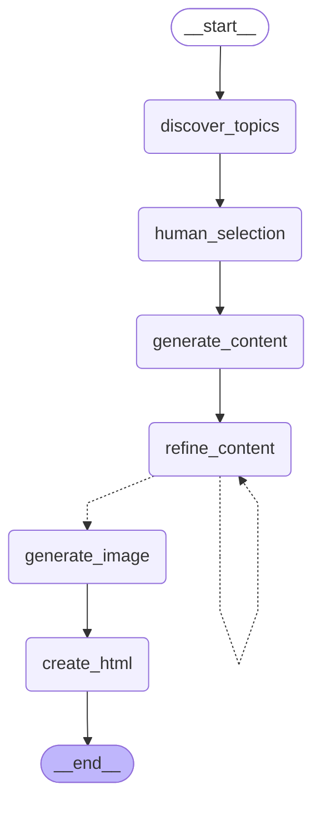

```mermaid
%%{init: {'flowchart': {'curve': 'linear'}}}%%
graph TD;
	__start__([<p>__start__</p>]):::first
	discover_topics(discover_topics)
	human_selection(human_selection)
	generate_content(generate_content)
	refine_content(refine_content)
	generate_image(generate_image)
	create_html(create_html)
	__end__([<p>__end__</p>]):::last
	__start__ --> discover_topics;
	create_html --> __end__;
	discover_topics --> human_selection;
	generate_content --> refine_content;
	generate_image --> create_html;
	human_selection --> generate_content;
	refine_content -.-> generate_image;
	refine_content -.-> refine_content;
	classDef default fill:#f2f0ff,line-height:1.2
	classDef first fill-opacity:0
	classDef last fill:#bfb6fc

```